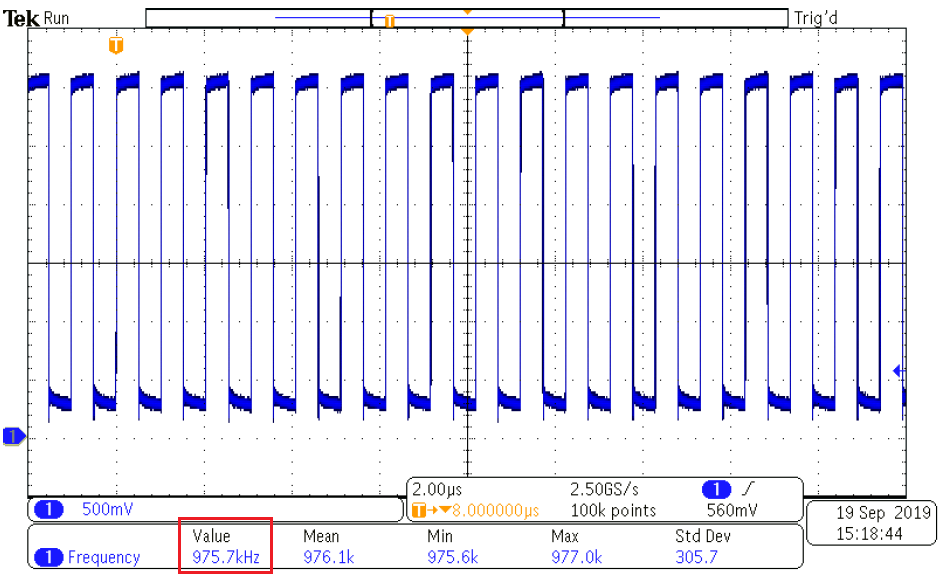

 <article class="markdown-body entry-content p-3 p-md-6" itemprop="This needs to locked down and 'never' changed">

# Internal High-Frequency Oscillator Calibration Using the Auto-Tune Feature

This repository contains examples of bare metal source code for TCD as described in [*TB3234 - Internal High-Frequency Oscillator Calibration Using the Auto-Tune Feature*](https://www.microchip.com/wwwappnotes/appnotes.aspx?appnote=en1001520) document from Microchip. The repository contains an Atmel Studio Solution (*Autotuning_feature.atsln*) projects inside, containing one project demonstrating the Auto-tune feature of the Internal High-Frequency Oscillator present on the AVR DA family of microcontrollers.

Use cases:
1. Configure OSCHF to run at 1 MHz and activate/deactivate the auto-tune feature
 - *Use case description:* The purpose of this use case is to configure the OSCHF to run at 1 MHz and drive the main clock, and enable
frequency output on the CLKOUT pin. Two frequency measurements on the CLKOUT pin will be made using an oscilloscope - with auto-tune feature activated and deactivated.
 - *Result:* A comparison between the two scenarios (auto-tune feature activated and auto-tune feature deactivated) will be made
2. Configure OSCHF to run at 4 MHz and activate/deactivate the auto-tune feature
 - *Use case description:* The purpose of this use case is to configure the OSCHF to run at 4 MHz and drive the main clock, and enable
frequency output on the CLKOUT pin. Two frequency measuremets on the CLKOUT pin will be made using an oscilloscope - with auto-tune feature activated and deactivated.
 - *Result:* A comparison between the two scenarios (auto-tune feature activated and auto-tune feature deactivated) will be made
3. Configure OSCHF to run at 24 MHz and activate/deactivate the auto-tune feature
 - *Use case description:* The purpose of this use case is to configure the OSCHF to run at 24 MHz and drive the main clock, and enable
frequency output on the CLKOUT pin. Two frequency measuremets on the CLKOUT pin will be made using an oscilloscope - with auto-tune feature activated and deactivated
 - *Result:* A comparison between the two scenarios (auto-tune feature activated and auto-tune feature deactivated) will be made
4. Configure OSCHF to run at 4 MHz with incorrect tuning value
 - *Use case description:* The purpose of this use case is to configure the OSCHF to run at 4 MHz and drive the main clock, and enable
frequency output on the CLKOUT pin. An error injection will be made to the tune register to check if the autotune mechanism will be able to correct it.
Two frequency measuremets on the CLKOUT pin will be made using an oscilloscope - with the incorrect frequency tune input and with auto-tune feature activated
 - *Result:* A comparison between the two scenarios (auto-tune feature activated and incorrect tune setting) will be made

## Related Documentation
More details and code examples on the AVR128DA48 can be found at the following links:
- [TB3234 - Internal High-Frequency Oscillator Calibration Using the Auto-Tune Feature](https://www.microchip.com/wwwappnotes/appnotes.aspx?appnote=en1001520)
- [AVR128DA48 Product Page](https://www.microchip.com/wwwproducts/en/AVR128DA48)
- [AVR128DA48 Code Examples on GitHub](https://github.com/microchip-pic-avr-examples?q=avr128da48)
- [AVR128DA48 Project Examples in START](https://start.atmel.com/#examples/AVR128DA48CuriosityNano)

## Software Used
- Atmel Studio 7.0.2397 or newer [(microchip.com/mplab/avr-support/atmel-studio-7)](https://www.microchip.com/mplab/avr-support/atmel-studio-7)
- AVR-Dx 1.0.18 or newer Device Pack

## Hardware Used
- AVR128DA48 Curiosity Nano [(DM164151)](https://www.microchip.com/Developmenttools/ProductDetails/DM164151)

## Setup for Use Case #1
**Configure OSCHF to run at 1 MHz and activate/deactivate the auto-tune feature**

The AVR128DA48 Curiosity Nano Development Board is used as test platform.
 

 The following configurations must be made for this project:

Clock:
  - OSCHF as main clock source
  - OSCHF frequency set to 1 MHz
  - Enable external 32 kHz crystal oscillator
  - Enable CLKOUT on PA7 pin

|Pin           | Configuration      |
| :----------: | :----------------: |
|PC7 (SW0)     | Digital Input      |

## Operation for Use Case #1
**Configure OSCHF to run at 1 MHz and activate/deactivate the auto-tune feature**
1. Connect the board to the PC.

2. Open the *Autotuning_feature.atsln* solution in Atmel Studio

3. Build the *Autotuning_feature* project: right click on *Autotuning_feature* and select Build
 

4. Select the AVR128DA48 Curiosity Nano on-board debugger in the *Tool* section of the *AVR-Dx_Bootloader* project settings:
  - Right click on the project and click *Properties*;
  - Click *Tool* tab on the left panel, select the corresponding debugger and save the configuration (Ctrl + S)
 

5. Program *Autotuning_feature* project to the board: select *Autotuning_feature* project and click *Start Without Debugging*:
 

 Pressing the SW0 button on the AVR128DA48 Curiosity Nano will enable the auto-tune feature, then it will disable it.

 **Results**
 PA7 (CLKOUT) - with auto-tune feature deactivated (CLK configured to run at 1 MHz)
 

 PA7 (CLKOUT) - with auto-tune feature activated (CLK configured to run at 1 MHz)
 

## Setup for Use Case #2

**Configure OSCHF to Run at 4 MHz and Activate/Deactivate the Auto-Tune Feature**

 The following configurations must be made for this project:

Clock:
  - OSCHF as main clock source
  - OSCHF frequency set to 4 MHz
  - Enable external 32 kHz crystal oscillator
  - Enable CLKOUT on PA7 pin

|Pin           | Configuration      |
| :----------: | :----------------: |
|PC7 (SW0)     | Digital Input      |

## Operation for Use Case #2
**Configure OSCHF to Run at 4 MHz and Activate/Deactivate the Auto-Tune Feature**

1. Change the frequency settings to 4 MHz as described in TB3234 - Internal High-Frequency Oscillator Calibration Using the Auto-Tune Feature and program the project to the board (see instructions above).

 **Results**
 PA7 (CLKOUT) - with auto-tune feature deactivated (CLK configured to run at 4 MHz)
 

 PA7 (CLKOUT) - with auto-tune feature activated (CLK configured to run at 4 MHz)
 

## Setup for Use Case #3

**Configure OSCHF to Run at 24 MHz and Activate/Deactivate the Auto-Tune Feature**

 The following configurations must be made for this project:

Clock:
 - OSCHF as main clock source
 - OSCHF frequency set to 24 MHz
 - Enable external 32 kHz crystal oscillator
 - Enable CLKOUT on PA7 pin

|Pin           | Configuration      |
| :----------: | :----------------: |
|PC7 (SW0)     | Digital Input      |

## Operation for Use Case #3
**Configure OSCHF to Run at 24 MHz and Activate/Deactivate the Auto-Tune Feature**

1. Change the frequency settings to 24 MHz as described in TB3234 - Internal High-Frequency Oscillator Calibration Using the Auto-Tune Feature and program the project to the board (see instructions above).

 **Results**
 PA7 (CLKOUT) - with auto-tune feature deactivated (CLK configured to run at 24 MHz)
 

 PA7 (CLKOUT) - with auto-tune feature activated (CLK configured to run at 24 MHz)
 

## Setup for Use Case #3

**Configure OSCHF to Run at 4 MHz with Incorrect Tuning Value**

 The following configurations must be made for this project:

Clock:
 - OSCHF as main clock source
 - OSCHF frequency set to 4 MHz
 - Enable external 32 kHz crystal oscillator
 - Enable CLKOUT on PA7 pin

|Pin           | Configuration      |
| :----------: | :----------------: |
|PC7 (SW0)     | Digital Input      |

## Operation for Use Case #3
**Configure OSCHF to Run at 4 MHz with Incorrect Tuning Value**

1. Change the frequency settings to 4 MHz with incorrect tune value as described in TB3234 - Internal High-Frequency Oscillator Calibration Using the Auto-Tune Feature and program the project to the board (see instructions above).

 **Results**
 PA7 (CLKOUT) - with incorrect tuning value (CLK configured to run at 4 MHz)
 

 PA7 (CLKOUT) - with auto-tune feature activated (CLK configured to run at 4 MHz)
 

## Summary
The [*TB3234 - Internal High-Frequency Oscillator Calibration Using the Auto-Tune Feature*](https://www.microchip.com/wwwappnotes/appnotes.aspx?appnote=en1001520) document provides four use cases for auto-tune implementation.
